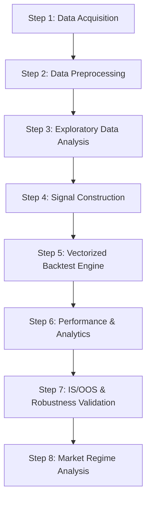
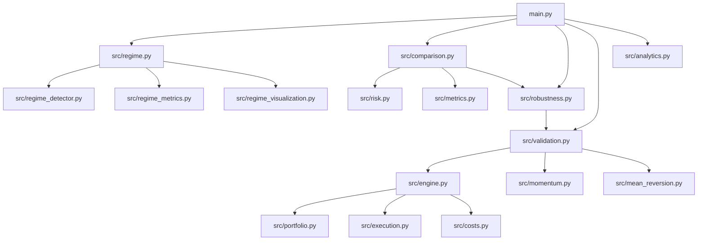
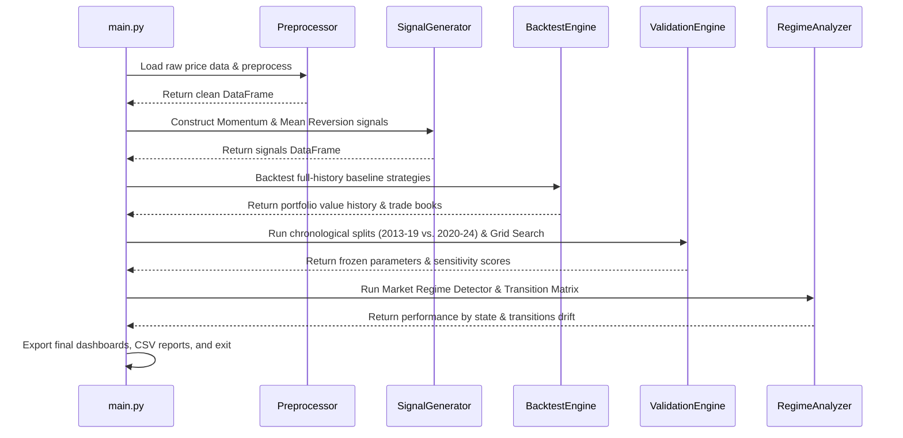

# System Architecture Documentation

This document describes the technical architecture, data pipelines, module dependencies, and execution flow of the **Systematic Momentum & Mean-Reversion Strategy Backtester**.

---

## 1. High-Level Pipeline Workflow

The platform follows a modular, state-driven workflow where data is ingested, cleaned, processed into signals, simulated via a vectorized execution engine, and analyzed for performance, validation, and market regimes.



---

## 2. Module Dependency Graph

The platform's source code under `src/` is decoupled into isolated layers:



---

## 3. Data Flow Architecture

The data flows from raw market values into structured risk adjusted profiles:

```
[Raw YFinance CSV] 
       ↓ (validate schema, handle gaps)
[Cleaned Parquet]
       ↓ (apply look-ahead bias shift)
[Execution Signals]
       ↓ (apply costs/slippage metrics)
[Daily Portfolio & Trade Book Log]
       ↓ (IS/OOS Splits & Regime Labels)
[Validation Scorecards & 60 Figures]
```

---

## 4. Execution Sequence Timeline

When `main.py` is invoked, the execution flow runs sequentially as follows:



---

## 5. Description of Core Modules

### 1. Data & Preprocessing Layer
* **`src/data_loader.py`**: Downloads ticker history from Yahoo Finance, validates columns, and handles data preservation.
* **`src/preprocessing.py`**: Cleans pricing series, checks for missing data, and exports standardized Parquet datasets.
* **`src/indicators.py`**: Computes rolling metrics (Averages, standard deviations, realized volatility, rolling drawdown series).

### 2. Signal Generation Layer
* **`src/momentum.py`**: Generates Dual Moving Average Crossover signals. Shifts signals by 1 day to prevent look-ahead bias.
* **`src/mean_reversion.py`**: Implements Z-Score bands with an entry/exit Finite State Machine (FSM) to handle position transitions.

### 3. Backtesting & Execution Layer
* **`src/engine.py`**: Unified interface for vectorized simulations.
* **`src/execution.py`**: Maps signals to physical shares using `next_open` or `close` execution assumptions.
* **`src/costs.py`**: Computes transaction friction (bps) and slippage on both entry and exit legs.
* **`src/portfolio.py`**: Calculates equity curves, daily returns, and compounding.

### 4. Performance & Validation Layer
* **`src/metrics.py` & `src/risk.py`**: Computes Sharpe, Sortino, Calmar, Max Drawdown duration, volatility, and benchmark beta.
* **`src/validation.py`**: Partitions data chronologically and manages parameter sweep grids.
* **`src/robustness.py`**: Executes sensitivity sweeps in parameter neighborhoods and computes Generalization and Stability scores.
* **`src/comparison.py`**: Formats side-by-side comparison tables and generates robustness plots.

### 5. Market Regime Layer
* **`src/regime_detector.py`**: Classifies trend, volatility, and crash/recovery states.
* **`src/regime_metrics.py`**: Computes performance on synthetic contiguous return series by regime.
* **`src/regime_visualization.py`**: Creates heatmaps, calendars, and comprehensive dashboards.
