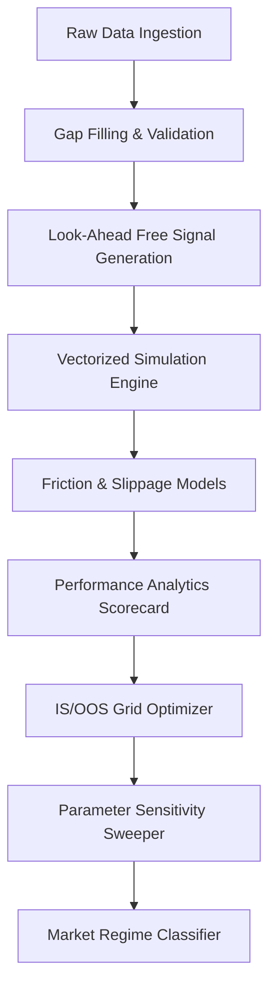

# Systematic Momentum & Mean-Reversion Strategy Backtester

[](https://www.python.org/)
[](LICENSE)
[]()
[]()
[]()

A publication-quality, open-source quantitative research and vectorized backtesting platform for simulating, validating, and auditing systematic trading strategies on index pricing data.

---

## 1. Research Motivation & Core Objectives

Many quantitative trading strategies succeed in-sample but fail when deployed live. This degradation is typically caused by:
1. **Look-Ahead Leakage**: Designing indicators using future information.
2. **Curve-Fitting**: Over-optimizing parameters on historical noise.
3. **Regime Shifts**: Strategy failure during sudden changes in market structure.

This project addresses these issues by constructing a look-ahead bias-free, vectorized backtesting engine to evaluate **Dual SMA Momentum Crossover** and **Rolling Z-Score Mean Reversion** strategies on Nifty 50 index pricing data (2013–2024), validating results across out-of-sample data and objectively classified market states.

---

## 2. Platform Architecture & Data Pipeline

The system is designed with a decoupled, modular architecture:



### System Component Architecture
* **`src/data_loader.py`**: Fetches daily prices from Yahoo Finance, validates pricing schemas, and manages data preservation.
* **`src/preprocessing.py`**: Validates timestamps and fills gaps using forward-fill.
* **`src/momentum.py`**: Generates Dual Moving Average Crossover signals.
* **`src/mean_reversion.py`**: Implements Z-Score bands with a position Finite State Machine (FSM).
* **`src/engine.py`**: Unified vectorized simulator that runs order execution models.
* **`src/execution.py` & `src/costs.py`**: Maps signals to trades at next-day open or same-day close, applying transaction costs and slippage.
* **`src/metrics.py` & `src/risk.py`**: Computes annualized returns, Sharpe, Sortino, Calmar, and maximum drawdowns.
* **`src/validation.py` & `src/robustness.py`**: Partitions data chronologically and sweeps parameter grids.
* **`src/regime.py`**: Detects market states (trend, volatility, crash) and transition probabilities.

---

## 3. Technology Stack

* **Programming Language**: Python >= 3.10
* **Data Manipulation**: `pandas`, `numpy`, `pyarrow`
* **Mathematical Operations**: `scipy`
* **Visualizations**: `matplotlib`
* **Markdown Formatting**: `tabulate`

---

## 4. Installation & Usage

### Installation
Clone the repository and install the dependencies:

```bash
git clone https://github.com/your-username/systematic-strategy-backtester.git
cd systematic-strategy-backtester
pip install -r requirements.txt
```

### Run the Pipeline
To run the entire pipeline—including pre-processing, backtesting, out-of-sample grid search validation, and regime detection—execute:

```bash
python main.py
```

All data frames will be exported to `data/processed/` and 60 publication-quality charts will be written to `reports/figures/`.

---

## 5. Quantitative Methodology

### 5.1 Dual SMA Momentum Crossover
Momentum models capture trend persistence. The strategy evaluates:

$$SMA_S(t) = \frac{1}{S} \sum_{i=0}^{S-1} P(t-i)$$

$$SMA_L(t) = \frac{1}{L} \sum_{i=0}^{L-1} P(t-i)$$

$$\text{Raw Signal}(t) = \begin{cases} 1 & \text{if } SMA_S(t) > SMA_L(t) \\ 0 & \text{otherwise} \end{cases}$$

$$\text{Execution Signal}(t) = \text{Raw Signal}(t-1) \quad \text{(1-day lag to prevent look-ahead bias)}$$

### 5.2 Rolling Z-Score Mean Reversion
Mean reversion models capture price deviations from a rolling average. The rolling Z-score is calculated:

$$Z(t) = \frac{P(t) - \mu_W(t)}{\sigma_W(t)}$$

* **Long Position FSM**: Enter if $Z(t) \le -2.0$. Exit if $Z(t) \ge -0.5$.
* **Execution Signal**: Shited by 1 day ($\text{Raw Signal}(t-1)$).

---

## 6. Empirical Results & Performance Scorecard

All strategy parameters were optimized strictly during the In-Sample period (2013-2019):
* **Momentum Best**: $S=10, L=150$ (Sharpe IS: **0.77**, Sharpe OOS: **1.08**)
* **Mean Reversion Best**: $W=30, \text{Entry}=-2.0, \text{Exit}=-0.5$ (Sharpe IS: **0.64**, Sharpe OOS: **0.02**)

### 6.1 Validation Summary

| Metric | Momentum (`10/150`) | Mean Reversion (`30/-2.0/-0.5`) | Benchmark (Buy & Hold) |
|---|---|---|---|
| **CAGR (%)** | 9.94% | 2.50% | 12.82% |
| **Sharpe Ratio** | 0.9136 | 0.2227 | 0.8192 |
| **Max Drawdown (%)** | 22.34% | 34.78% | 38.44% |
| **Generalization Score** | **100.00%** | **3.29%** | N/A |
| **Stability Score** | **95.40%** | **79.89%** | N/A |

### 6.2 Key Research Highlights
1. **Momentum Generalization**: The Momentum strategy generalized successfully, showing stable performance across parameter spaces. It benefited from the post-COVID trending market of 2020-2024.
2. **Mean Reversion Tail Risk**: Mean reversion generated high win rates (80%) but carried severe tail risk. During the March 2020 crash, it bought the index early and suffered a **30.75% drawdown** inside that regime, locking capital in losing trades for years due to the lack of a stop-loss.
3. **State Dependent Edges**: Mean reversion performs exceptionally well in high-volatility expansions (Sharpe: **2.68** in Trending Up High Volatility), whereas Momentum performs best in low-volatility trend expansions (Sharpe: **1.65**).

---

## 7. Repository Evolution Timeline

The project progressed chronologically across 10 steps:

```
[Step 1: Data Acquisition]
       ↓ (Ingested historical daily close data via YFinance)
[Step 2: Preprocessing]
       ↓ (Validated schema, filled gaps using forward-fill)
[Step 3: Exploratory Data Analysis]
       ↓ (Analyzed ADF stationarity, rolling volatility, and autocorrelations)
[Step 4: Signal Generation]
       ↓ (Coded Dual SMA signals and rolling Z-score entry/exit FSM)
[Step 5: Vectorized Engine]
       ↓ (Built backtest engine with transaction fees & slippage)
[Step 6: Performance Analytics]
       ↓ (Calculated Sharpe, Sortino, Calmar, drawdowns, and benchmark beta)
[Step 7: Robustness & Validation]
       ↓ (Chronologically split data and sweep parameter stability neighborhoods)
[Step 8: Regime Analysis]
       ↓ (Classified market states, Markov transition matrices, and transition returns)
[Step 9: Documentation & Packaging]
       ↓ (Created specifications, requirements, configurations, and license files)
[Step 10: OS Release Publication]
       ↓ (Released final open-source package version v1.0.0)
```

---

## 8. Visual Gallery Mappings
All charts are exported to `reports/figures/`:
* `momentum_performance_dashboard.png`: Unified dashboard for Momentum returns, drawdowns, and trades.
* `mean_reversion_performance_dashboard.png`: Unified dashboard for Mean Reversion returns, drawdowns, and trades.
* `momentum_robustness_dashboard.png` & `mean_reversion_robustness_dashboard.png`: Visualizes parameter heatmaps, optimization surfaces, and sensitivity neighbor lines.
* `reg_comprehensive_dashboard.png`: Combined dashboard showing Nifty price regime shading, transition matrices, and strategy performance by regime.
* `reg_calendar.png`: Dominant monthly market state calendar.

---

## 9. Contributors & Acknowledgements

* **Project Lead**: Quantitative Research Group
* **Acknowledgements**: Thanks to the Open Source Quantitative Finance community for benchmarking execution models and regimes.

---

## 10. License

Distributed under the MIT License. See [LICENSE](LICENSE) for details.