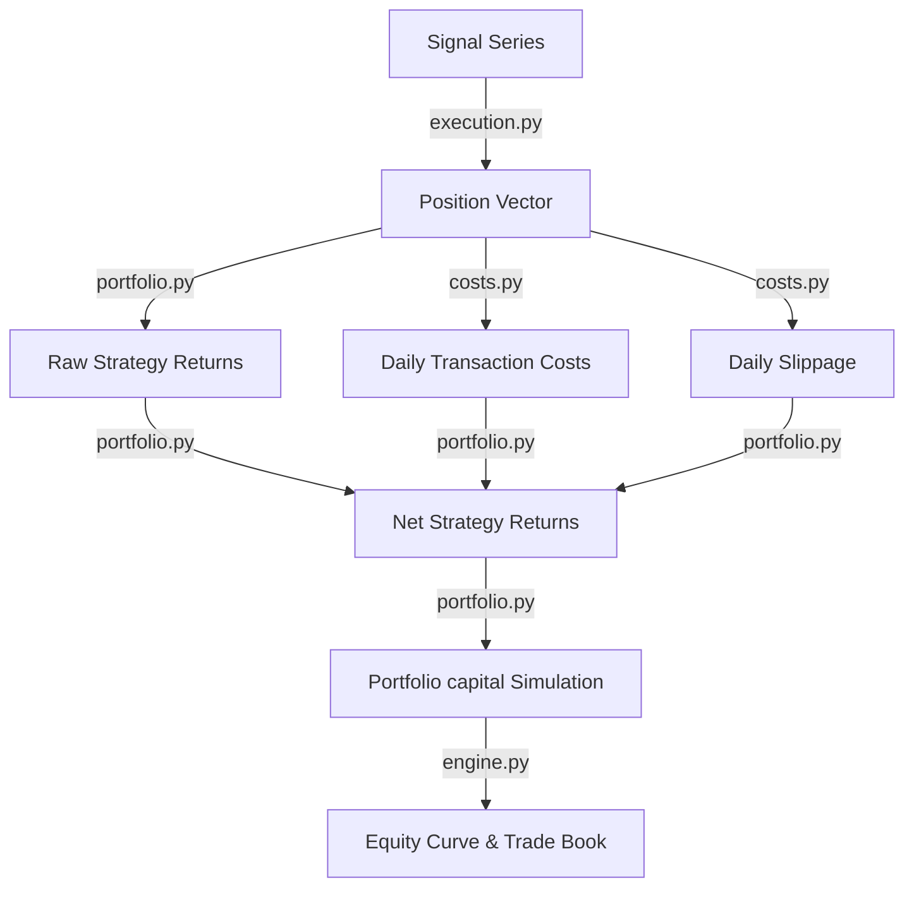

# Vectorized Backtesting Engine Summary

This report documents the architectural design, execution model, cost structure, simulation logic, and initial empirical results of the **Vectorized Backtesting Engine** implemented in Step 5.

---

## 1. Engine Architecture

The engine is built on a highly modular, decoupled design. Each stage in the backtesting pipeline is isolated in its own mathematical function:

### Components
1. **Execution Model (`execution.py`)**: Responsible for mapping raw signals (0, 1) to target position states (0.0, 1.0, or -1.0 for short) based on execution lags to prevent look-ahead bias.
2. **Costs & Slippage Model (`costs.py`)**: Vectorially calculates transaction costs and slippage as returns impact, triggered only on day-to-day position transitions.
3. **Portfolio Simulator (`portfolio.py`)**: Computes asset returns (simple or log), calculates raw strategy returns under custom execution pricing, and simulates daily capital growth.
4. **Engine Orchestrator (`engine.py`)**: Integrates the other modules, generates the detailed Trade Book history, compiles backtest summaries, and returns a structured `BacktestResult` dataclass.

---

## 2. Mathematical Formulations & Execution Lags

### Execution Models
To prevent look-ahead bias (future leakage), we map raw signals generated today ($t$) to trades executed tomorrow ($t+1$):
* **Next Open Execution (`next_open` - Default)**:
  Signals computed using $t$'s close price are executed at $Open_{t+1}$.
  * Entry Day return (transition $0 \to 1$):
    $$R_{entry, t+1} = \frac{Close_{t+1} - Open_{t+1}}{Open_{t+1}}$$
  * Hold Day return (transition $1 \to 1$):
    $$R_{hold, t+1} = \frac{Close_{t+1} - Close_t}{Close_t}$$
  * Exit Day return (transition $1 \to 0$):
    $$R_{exit, t+1} = \frac{Open_{t+1} - Close_t}{Close_t}$$
  This is a mathematically precise representation of a next-open execution system.
* **Next Close Execution (`next_close`)**:
  Signals computed using $t$'s close price execute at $Close_{t+1}$.
  $$\text{Position}_{t+1} = \text{Raw\_Signal}_{t-1}$$
  $$\text{Strategy\_Return}_{t+1} = \text{Position}_{t+1} \times \frac{Close_{t+1} - Close_t}{Close_t}$$

### Transaction Costs and Slippage
Transaction costs and slippage are expressed in return units and subtracted directly from raw strategy returns:
* **Turnover Calculation**:
  We decompose the position series $P$ into daily entry turnover $T_{entry}$ and exit turnover $T_{exit}$ to support long, short, and sign-flips (e.g. $+1 \to -1$):
  * For same-sign transitions ($P_t \times P_{t-1} \geq 0$):
    $$T_{entry, t} = \max(0, |P_t| - |P_{t-1}|)$$
    $$T_{exit, t} = \max(0, |P_{t-1}| - |P_t|)$$
  * For opposite-sign transitions (flips, $P_t \times P_{t-1} < 0$):
    $$T_{entry, t} = |P_t|$$
    $$T_{exit, t} = |P_{t-1}|$$
* **Return Impact**:
  Daily cost return impact $C_t$ and slippage impact $S_t$ are calculated as:
  $$C_t = T_{total, t} \times \text{cost\_rate}$$
  $$S_t = T_{total, t} \times \text{slippage\_rate}$$
  where $T_{total, t} = T_{entry, t} + T_{exit, t}$.

---

## 3. Empirical Results (Backtest Summary)

Both strategies were simulated with the following baseline settings:
* **Initial Capital**: ₹100,000
* **Transaction Cost Rate**: 5 basis points ($0.0005$ or $0.05\%$)
* **Slippage Rate**: 2 basis points ($0.0002$ or $0.02\%$)
* **Execution Model**: Next Open (`next_open`)
* **Return Type**: Simple

### Comparative Performance Table

| Metric | Momentum Crossover | Mean Reversion Z-Score |
|---|---|---|
| **Initial Capital** | ₹100,000.00 | ₹100,000.00 |
| **Final Capital** | ₹227,462.79 | ₹127,333.93 |
| **Total Strategy Return** | 127.46% | 27.33% |
| **Total Trades** | 16 | 49 |
| **Total Turnover** | 32.0 units | 97.0 units |
| **Total Cost Paid (Rupees)** | ₹3,113.64 | ₹7,845.07 |
| **Average Hold Duration** | 127.38 trading days | 7.20 trading days |

---

## 4. Analytical Observations

1. **Trade Frequency and Cost Drag**: 
   * The **Momentum Crossover** strategy trades very slowly (16 trades over 11 years), leading to a low turnover of 32.0 and paying only ₹3,113.64 in trading fees. 
   * The **Mean Reversion Z-Score** strategy trades much more frequently (49 trades), resulting in a high turnover of 97.0 and paying ₹7,845.07 in fees. 
   * In mean reversion, transaction costs represent a significant drag (eating away approximately $7.85\%$ of starting capital), highlighting why cost modeling is essential.
2. **Holding Periods**:
   * Momentum has a long average hold period of 127.38 days, capturing broad market trends.
   * Mean Reversion holds trades for an average of 7.20 days, capturing short-term market inefficiencies and corrections before returning to cash.

---

## 5. Assumptions & Limitations

### Assumptions
* **Frictional Pricing**: Assumes that we can enter exactly at the daily Open price or Close price without price impact beyond the fixed 2 bps slippage.
* **Fractional Shares**: Assumes capital is fully reinvested daily, allowing fractional share holdings.
* **Infinite Liquidity**: Assumes trades of any size can be executed at the configured Open/Close prices.

### Limitations of Vectorized Models
* **Intraday Paths**: Vectorized backtests cannot easily handle intraday stop-losses or profit targets. For path-dependent risk management, an event-driven backtesting engine is required.
* **Margin and Borrowing**: Borrowing fees for shorting are simplified.
